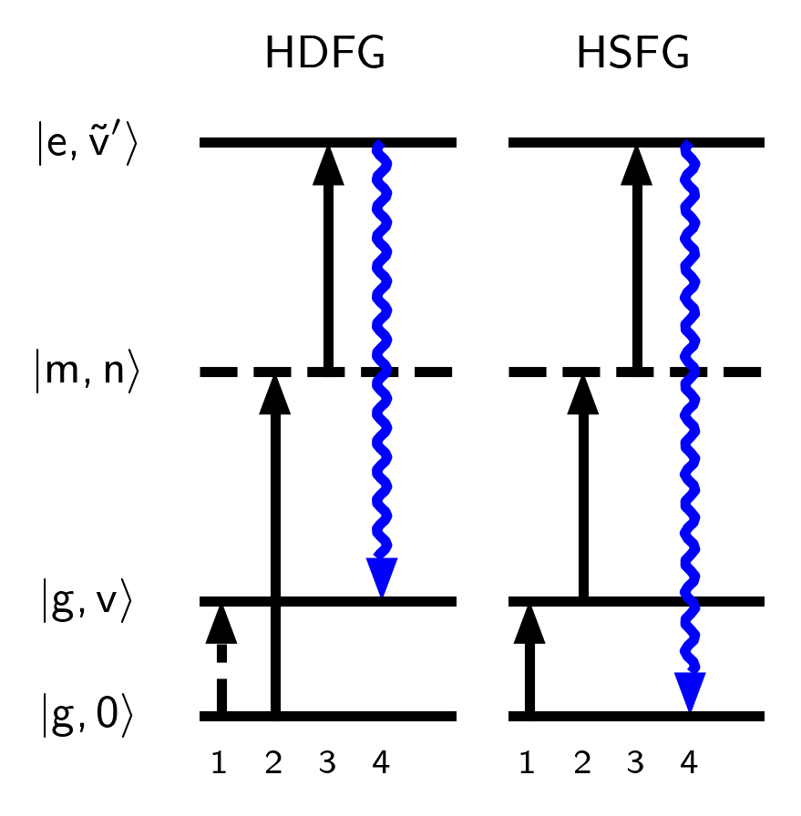

# Coherent IR-Hyper-Raman Four Wave Mixing Spectroscopy

See the article that utilizes this code: [Coherent IR-hyper-Raman four wave mixing spectroscopy](https://doi.org/10.1063/5.0231422).

## Instructions for use

1. Clone this repository and make sure you have the package requirements (see `requirements.txt`)
2. Create an environment with the package dependencies.  e.g. using conda:
  ```
  conda create -n hyperraman
  conda install --file requirements.txt
  ```
3. Run this script e.g. on Windows:
  ```
  python build.py all
  ```
  see `python build.py --help` for more detailed build instructions

## Figures folder

For examination of individual figures, each figure script has a command line interface to create/examine plots with simple options.
Call e.g. `python fig1.py --help` for more information.
